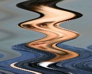
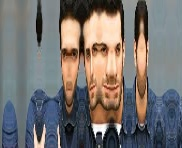
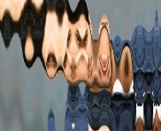
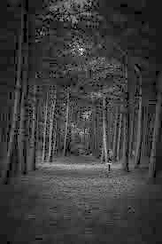
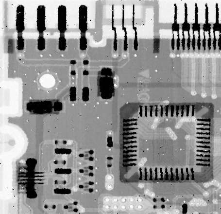

# OpenCV Image Processing Projects

A collection of image-processing projects developed with Python, OpenCV and NumPy. The repository demonstrates geometric transformations, gamma correction, noise generation, median filtering and BGR colour-channel separation.

## Projects

### 1. Image Rotation and Wave Distortion

This project uses OpenCV transformation functions to rotate an image without cropping and apply a sinusoidal wave-distortion effect.

**Python file:** `opencv-image-transformations/image_transformations.py`

#### Rotated Image


#### Wave Distortion



---

### 2. Manual Geometric Transformations

This project manually creates pixel-coordinate maps and uses `cv2.remap` to apply rotation, wave distortion and a combined transformation.

**Python file:** `manual-geometric-transformations/manual_transformations.py`

#### Rotation


#### Wave Transformation



#### Combined Transformation



---

### 3. HSV Gamma Correction

This project converts an image from BGR to HSV colour space and applies gamma correction to the Value channel. The corrected values are normalised before the image is converted back to BGR.

**Python file:** `gamma-correction/gamma_correction_hsv.py`

#### Gamma-Corrected Image



---

### 4. Salt-and-Pepper Noise and Median Filtering

This project adds salt-and-pepper noise to a grayscale image and then removes the noise using a manually implemented 3×3 median filter.

**Python files:**

* `noise-filtering/salt_pepper_noise.py`
* `noise-filtering/manual_median_filter.py`

#### Noisy Image


#### Median-Filtered Image



---

### 5. BGR Colour-Channel Separation

This project separates a colour image into its Blue, Green and Red channels and then merges the channels to reconstruct the original image.

**Python file:** `color-channel-separation/color_channel_separation.py`

#### Blue Channel


#### Green Channel


#### Red Channel


#### Merged Image


## Technologies

* Python
* OpenCV
* NumPy

## Project Structure

```text
opencv-image-processing/
├── opencv-image-transformations/
│   ├── image_transformations.py
│   ├── tabdil.jpg
│   ├── rotated_output.jpg
│   └── waved_output.jpg
│
├── manual-geometric-transformations/
│   ├── manual_transformations.py
│   ├── tabdil.jpg
│   ├── transform_rotation.jpg
│   ├── transform_wave.jpg
│   └── transform_combined.jpg
│
├── gamma-correction/
│   ├── gamma_correction_hsv.py
│   ├── tamrin3.jpg
│   └── gamma_corrected.jpg
│
├── noise-filtering/
│   ├── salt_pepper_noise.py
│   ├── manual_median_filter.py
│   ├── tamrin4.jpg
│   ├── noisy_salt_pepper.jpg
│   └── median_filtered.jpg
│
├── color-channel-separation/
│   ├── color_channel_separation.py
│   ├── tabdil.jpg
│   ├── blue_channel.jpg
│   ├── green_channel.jpg
│   ├── red_channel.jpg
│   └── merged_image.jpg
│
├── requirements.txt
└── README.md
```

## Installation

Clone the repository:

```bash
git clone https://github.com/PouyaGoshayeshi/opencv-image-processing.git
cd opencv-image-processing
```

Create a virtual environment:

```bash
python -m venv .venv
```

Activate the virtual environment on Windows:

```bash
.venv\Scripts\activate
```

Install the required packages:

```bash
pip install -r requirements.txt
```

## Usage

Enter the relevant project folder before running its Python program.

### Image Transformations

```bash
cd opencv-image-transformations
python image_transformations.py
```

### Manual Transformations

```bash
cd manual-geometric-transformations
python manual_transformations.py
```

### Gamma Correction

```bash
cd gamma-correction
python gamma_correction_hsv.py
```

### Noise Generation and Filtering

```bash
cd noise-filtering
python salt_pepper_noise.py
python manual_median_filter.py
```

### Colour-Channel Separation

```bash
cd color-channel-separation
python color_channel_separation.py
```

## Skills Demonstrated

* Image loading, display and saving
* BGR and HSV colour spaces
* Colour-channel manipulation
* Gamma correction and normalisation
* Affine image rotation
* Coordinate mapping with `cv2.remap`
* Sinusoidal wave distortion
* Salt-and-pepper noise generation
* Manual median-filter implementation
* NumPy array operations

## Author

**Pouya Goshayeshi**
